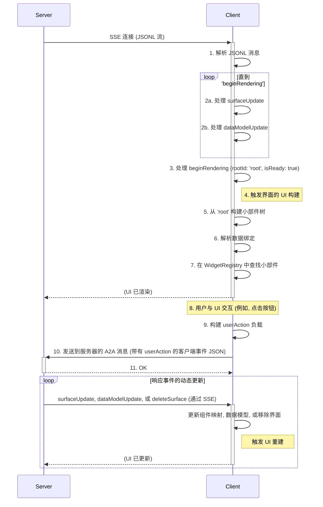
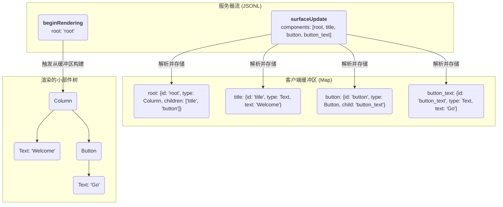

<!-- markdownlint-disable MD041 -->
<!-- markdownlint-disable MD033 -->
<div style="text-align: center;">
  <div class="centered-logo-text-group">
    
    <h1>A2UI (Agent to UI) 协议</h1>
  </div>
</div>

基于 JSONL 的流式 UI 协议规范

创建时间：2025年9月19日
更新时间：2025年11月12日

## 设计需求

A2UI (Agent to UI) 协议应该是一个系统，LLM 可以通过它向客户端流式传输与平台无关的抽象 UI 定义，然后客户端使用原生小部件集渐进式地渲染它。每一个主要的设计选择都可以追溯到 LLM 生成的核心挑战、感知的性能和平台独立性。

### 需求：协议必须易于由 Transformer 大型语言模型 (LLM) 生成

这是最关键的驱动因素。这一需求直接导致了几个设计选择：

声明式、简单的结构：协议应使用直截了当的声明式格式（“这是一列，包含这些子项”），而不是命令式格式（“现在，添加一列；然后，向其追加一个文本小部件”）。LLM 擅长生成结构化的声明式数据。

扁平组件列表（邻接表）：要求 LLM 一次性生成完美嵌套的 JSON 树是困难且容易出错的。组件的扁平列表（其中关系由简单的字符串 ID 定义）更容易逐块生成。模型可以“构思”一个组件，给它一个 ID，稍后引用该 ID，而无需担心树的深度或对象嵌套。

无状态消息：每条 JSONL 消息都是一个自包含的信息单元 (componentUpdate, dataModelUpdate)。这对于流式 LLM 来说非常理想，因为它可以在处理请求时增量输出这些消息。

### 需求：UI 必须渐进式渲染以获得快速、响应迅速的用户体验

系统必须让用户感觉很快，即使完整的 UI 很复杂并且需要时间生成。

通过 JSONL/SSE 流式传输：这是一个直接的解决方案。客户端不必等待单个巨大的 JSON 负载。它可以立即开始接收和处理 UI 组件，从而提高感知的性能。

### 需求：协议必须与平台无关

相同的服务器端逻辑应该能够在 Flutter 应用、Web 浏览器或潜在的其他平台上渲染 UI，而无需修改。

客户端定义的小部件目录：这是平台无关设计的核心。协议应定义一个抽象的组件树（例如，“我需要一个里面有一行的卡片”）。客户端负责将这些抽象类型映射到其原生小部件实现（Flutter Card 小部件、带有卡片样式的 HTML `<div>` 等）。服务器只需要知道客户端支持的组件名称。

### 需求：状态管理必须高效且与 UI 结构解耦

更改 UI 中的一段文本不应要求重新发送整个 UI 定义。

数据和组件的分离：拥有不同的 componentUpdate 和数据模型更新消息是关键。UI 结构可以发送一次，随后的更新可以是仅包含已更改数据的较小的 dataModelUpdate 消息。

### 需求：通信架构必须健壮且可扩展

系统需要一种清晰、可靠的方式来处理服务器推送的 UI 和客户端发起的事件。

单向 UI 流：使用单向流 (SSE) 进行 UI 更新简化了客户端逻辑。它只需要监听并做出反应。对于服务器推送来说，这是一个比尝试管理复杂的双向通道更健壮的模式。

事件处理：事件处理通过从客户端发送到服务器代理的 A2A 消息完成。

## 简介

A2UI 协议是一种设计用于从服务器发送的 JSON 对象流渲染用户界面的协议。其核心理念强调 UI 结构和应用程序数据的清晰分离，从而在客户端处理每条消息时实现渐进式渲染。

该协议旨在“对 LLM 友好”，这意味着其结构是声明式且直截了当的，使得生成式模型易于生成。A2UI 的一个核心特性是其可扩展的组件模型。可用的 UI 组件集不由协议固定，而是在单独的 **目录 (Catalog)** 中定义，允许特定于平台或自定义的组件。

通信通过 JSON Lines (JSONL) 流进行。客户端将每一行解析为不同的消息并增量构建 UI。服务器到客户端协议定义了四种消息类型：

- `surfaceUpdate`: 提供要添加到或在称为“界面 (Surface)”的特定 UI 区域中更新的组件定义列表。
- `dataModelUpdate`: 提供要插入到或替换界面数据模型的新数据。每个界面都有其自己的数据模型。
- `beginRendering`: 向客户端发出信号，表明它有足够的信息来执行初始渲染，指定根组件的 ID，以及可选的要使用的组件目录。
- `deleteSurface`: 显式地从 UI 中移除界面及其内容。

客户端到服务器的用户交互通信通过 A2A 消息单独处理。此消息可以是以下两种类型之一：

- `userAction`: 报告来自组件的用户发起的动作。
- `error`: 报告客户端错误。
  这保持了主数据流的单向性。

## 第 1 节：基础架构和数据流

本文档规定了 A2UI 协议的架构和数据格式。设计遵循严格的关注点分离、版本控制和渐进式渲染原则。

### 1.1. 核心理念：解耦与契约

A2UI 的核心理念是三个关键要素的解耦：

1.  **组件树（结构）：** 服务器提供的抽象组件树，描述 UI 的结构。这由 `surfaceUpdate` 消息定义。
2.  **数据模型（状态）：** 服务器提供的 JSON 对象，包含填充 UI 的动态值，如文本、布尔值或列表。这通过 `dataModelUpdate` 消息管理。
3.  **小部件注册表（“目录”）：** 客户端定义的组件类型（例如 "Row", "Text"）到具体的原生小部件实现的映射。此注册表是 **客户端应用程序的一部分**，而不是协议流的一部分。服务器必须生成目标客户端注册表能理解的组件。

### 1.2. JSONL 流：通信单元

所有 UI 描述都作为 JSON 对象流从服务器传输到客户端，格式为 JSON Lines (JSONL)。每一行是一个单独的、紧凑的 JSON 对象，代表一条消息。这允许客户端在 UI 定义到达时解析和处理每一部分，实现渐进式渲染。

### 1.3. 界面 (Surfaces)：管理多个 UI 区域

**界面 (Surface)** 是屏幕上可以渲染 A2UI UI 的连续部分。协议引入了 `surfaceId` 概念来唯一标识和管理这些区域。这允许单个 A2UI 流同时控制多个独立的 UI 区域。每个界面都有单独的根组件和单独的组件层级结构。每个界面都有单独的数据模型，以避免在处理大量界面时发生键冲突。

例如，在聊天应用程序中，每个 AI 生成的响应都可以渲染到对话历史记录中的单独界面中。单独的持久界面可用于显示相关信息的侧面板。

`surfaceId` 是每个服务器到客户端消息中的属性，用于将更改定向到正确的区域。它与 `beginRendering`, `surfaceUpdate`, `dataModelUpdate`, 和 `deleteSurface` 等消息一起使用，以针对特定界面。

### 1.4. 数据流模型

A2UI 协议由描述 UI 的服务器到客户端流和发送到服务器的单个事件组成。客户端消费流，构建 UI 并进行渲染。通信通过 JSON Lines (JSONL) 流进行，通常通过 **Server-Sent Events (SSE)** 传输。

1.  **服务器流：** 服务器开始通过 SSE 连接发送 JSONL 流。
2.  **客户端缓冲：** 客户端接收消息并缓冲它们：

    - `surfaceUpdate`: 组件定义存储在 `Map<String, Component>` 中，按 `surfaceId` 组织。如果界面不存在，则创建它。
    - `dataModelUpdate`: 客户端的内部 JSON 数据模型被构建或更新。

3.  **渲染信号：** 服务器发送带有 `root` 组件 ID 的 `beginRendering` 消息。这防止了“内容不完整的一闪而过”。客户端缓冲传入的组件和数据，但等待此显式信号后再尝试首次渲染，确保初始视图是连贯的。
4.  **客户端渲染：** 客户端现在处于“就绪”状态，从 `root` 组件开始。它通过在缓冲区中查找组件 ID 递归遍历组件树。它针对数据模型解析任何数据绑定，并使用其 `WidgetRegistry` 实例化原生小部件。
5.  **用户交互和事件处理：** 用户与渲染的小部件交互（例如，点击按钮）。客户端构建 `userAction` JSON 负载，解析来自组件 `action.context` 的任何数据绑定。它通过 A2A 消息将此负载发送到服务器。
6.  **动态更新：** 服务器处理 `userAction`。如果 UI 需要响应更改，服务器通过原始 SSE 流发送新的 `surfaceUpdate` 和 `dataModelUpdate` 消息。随着这些消息到达，客户端更新其组件缓冲区和数据模型，UI 重新渲染以反映更改。服务器还可以发送 `deleteSurface` 来移除 UI 区域。



### 1.5. 完整流示例

以下是一个完整的、最小的 JSONL 流示例，用于渲染用户资料卡片。

```jsonl
{"surfaceUpdate": {"components": [{"id": "root", "component": {"Column": {"children": {"explicitList": ["profile_card"]}}}}]}}
{"surfaceUpdate": {"components": [{"id": "profile_card", "component": {"Card": {"child": "card_content"}}}]}}
{"surfaceUpdate": {"components": [{"id": "card_content", "component": {"Column": {"children": {"explicitList": ["header_row", "bio_text"]}}}}]}}
{"surfaceUpdate": {"components": [{"id": "header_row", "component": {"Row": {"alignment": "center", "children": {"explicitList": ["avatar", "name_column"]}}}}]}}
{"surfaceUpdate": {"components": [{"id": "avatar", "component": {"Image": {"url": {"literalString": "https://www.example.com/profile.jpg"}}}}]}}
{"surfaceUpdate": {"components": [{"id": "name_column", "component": {"Column": {"alignment": "start", "children": {"explicitList": ["name_text", "handle_text"]}}}}]}}
{"surfaceUpdate": {"components": [{"id": "name_text", "component": {"Text": {"usageHint": "h3", "text": {"literalString": "A2A Fan"}}}}]}}
{"surfaceUpdate": {"components": [{"id": "handle_text", "component": {"Text": {"text": {"literalString": "@a2a_fan"}}}}]}}
{"surfaceUpdate": {"components": [{"id": "bio_text", "component": {"Text": {"text": {"literalString": "Building beautiful apps from a single codebase."}}}}]}}
{"dataModelUpdate": {"contents": {}}}
{"beginRendering": {"root": "root"}}
```

## 第 2 节：组件模型

A2UI 的组件模型旨在灵活，将协议与组件集分离。

### 2.1. 目录协商

**目录 (Catalog)** 定义了服务器和客户端之间关于可渲染 UI 的契约。它包含支持的组件类型列表（例如 `Row`, `Text`）、它们的属性和可用样式。目录由 **目录定义文档** 定义。

每个版本的 A2UI 协议都有一个关联的 **标准目录**。对于 v0.8，其标识符是 `https://github.com/google/A2UI/blob/main/specification/0.8/json/standard_catalog_definition.json`。

目录 ID 是简单的字符串标识符。虽然它们可以是任何东西，但习惯上使用你拥有的域内的 URI，以简化调试、避免混淆和名称冲突。此外，如果对目录进行了任何可能破坏代理和渲染器之间兼容性的更改，**必须** 分配一个新的 `catalogId`。这确保了清晰的版本控制，防止如果代理有更改但客户端没有（反之亦然）时发生意外行为。

协商过程允许客户端和服务器就给定 UI 界面使用哪个目录达成一致。此过程旨在灵活，支持标准、自定义甚至动态定义的目录。

流程如下：

#### 1. 服务器通告能力

服务器（代理）作为 A2A 协议的一部分，在其 Agent Card 中通告其能力。对于 A2UI，这包括它支持哪些目录以及它是否可以处理客户端内联定义的目录。

- `supportedCatalogIds` (字符串数组，可选): 代理已知支持的所有预定义目录的 ID 列表。
- `acceptsInlineCatalogs` (布尔值，可选): 如果为 `true`，服务器可以处理客户端发送的 `inlineCatalogs`。默认为 `false`。

**服务器 Agent Card 片段示例：**
```json
{
  "name": "Restaurant Finder",
  "capabilities": {
    "extensions": [
      {
        "uri": "https://a2ui.org/a2a-extension/a2ui/v0.8",
        "params": {
          "supportedCatalogIds": [
            "https://github.com/google/A2UI/blob/main/specification/0.8/json/standard_catalog_definition.json",
            "https://my-company.com/a2ui/v0.8/my_custom_catalog.json"
          ],
          "acceptsInlineCatalogs": true
        }
      }
    ]
  }
}
```

请注意，这不是一个严格的契约，纯粹作为一个信号包含在内，以帮助编排器和客户端识别具有匹配 UI 能力的代理。在运行时，编排代理可能会动态地将任务委托给支持编排代理未通告的额外目录的子代理。因此，客户端应将通告的 `supportedCatalogIds` 视为代理或其子代理可能支持的真实目录的子集。

#### 2. 客户端声明支持的目录

在发送给服务器的 **每条** 消息中，客户端在 A2A `Message` 元数据中包含一个 `a2uiClientCapabilities` 对象。此对象通知代理服务器客户端可以渲染的所有目录。

- `supportedCatalogIds` (字符串数组，必需): 客户端支持的所有预定义目录的标识符列表。如果客户端支持标准目录，则必须在此处显式包含标准目录 ID。这些目录的内容预计将被编译到代理服务器中，而不是在运行时下载，以防止恶意内容被动态注入到提示词中，并确保可预测的结果。
- `inlineCatalogs` (对象数组，可选): 完整目录定义文档的数组。这允许客户端提供自定义的、即时的目录，通常用于本地开发工作流，此时在客户端一处更新目录更快。只有当服务器通告了 `acceptsInlineCatalogs: true` 时才能提供此项。

**带有客户端能力的 A2A 消息示例：**
```json
{
  "metadata": {
    "a2uiClientCapabilities": {
      "supportedCatalogIds": [
        "https://github.com/google/A2UI/blob/main/specification/0.8/json/standard_catalog_definition.json",
        "https://my-company.com/a2ui_catalogs/custom-reporting-catalog-1.2"
      ],
      "inlineCatalogs": [
        {
          "catalogId": "https://my-company.com/inline_catalogs/temp-signature-pad-catalog",
          "components": {
            "SignaturePad": {
              "type": "object",
              "properties": { "penColor": { "type": "string" } }
            }
          },
          "styles": {}
        }
      ]
    }
  },
  "message": {
    "prompt": {
      "text": "Find me a good restaurant"
    }
  }
}
```

#### 3. 服务器选择目录并渲染

服务器接收客户端的能力并为特定的 UI 界面选择要使用的目录。服务器使用 `catalogId` 字段在 `beginRendering` 消息中指定其选择。

- `catalogId` (字符串，可选): 所选目录的标识符。此 ID 必须是 `supportedCatalogIds` 之一，或者来自客户端提供的 `inlineCatalogs` 之一的 `catalogId`。

如果省略 `catalogId`，客户端 **必须** 默认为该协议版本的标准目录 (`https://github.com/google/A2UI/blob/main/specification/0.8/json/standard_catalog_definition.json`)。

**`beginRendering` 消息示例：**
```json
{
  "beginRendering": {
    "surfaceId": "unique-surface-1",
    "catalogId": "https://my-company.com/inline_catalogs/temp-signature-pad-catalog",
    "root": "root-component-id"
  }
}
```

每个界面可以使用不同的目录，提供了高度的灵活性，特别是在多代理系统中，不同的代理可能支持不同的目录。

#### 面向开发者的模式

构建代理时，建议使用包含你所针对的特定组件目录的已解析模式（例如，将 `server_to_client.json` 与你的 `https://my-company.com/a2ui_catalogs/custom-reporting-catalog-1.2` 定义结合的自定义模式）。这为 LLM 提供了所有可用组件及其属性以及特定于目录的样式的严格定义，从而产生更可靠的 UI 生成。通用的 `server_to_client.json` 是抽象的传输协议，而解析后的模式是用于生成的具体工具。

为了进行替换，基于标准的 `server_to_client_schema` 和 `custom_catalog_definition` 对象，你可以使用类似以下的 JSON 操作逻辑：

```py
component_properties = custom_catalog_definition["components"]
style_properties = custom_catalog_definition["components"]
resolved_schema = copy.deepcopy(server_to_client_schema)

resolved_schema["properties"]["surfaceUpdate"]["properties"]["components"]["items"]["properties"]["component"]["properties"] = component_properties
resolved_schema["properties"]["beginRendering"]["properties"]["styles"]["properties"] = style_properties
```

参见 `server_to_client_with_standard_catalog.json` 以获取已替换组件的解析模式示例。

### 2.2. `surfaceUpdate` 消息

此消息是定义 UI 结构的主要方式。它包含一个 `surfaceId` 和一个 `components` 数组。

```json
{
  "surfaceUpdate": {
    "surfaceId": "main_content_area",
    "components": [
      {
        "id": "unique-component-id",
        "component": {
          "Text": {
            "text": { "literalString": "Hello, World!" }
          }
        }
      },
      {
        "id": "another-component-id",
        "component": { ... }
      }
    ]
  }
}
```

- `components`: 必需的组件实例扁平列表。

### 2.3. 组件对象

`components` 数组中的每个对象具有以下结构：

- `id`: 必需的、唯一的字符串，标识此特定组件实例。这用于父子引用。
- `component`: 一个必需的对象，定义组件的类型和属性。

### 2.4. `component` (通用对象)

在传输中，此对象是通用的。其结构不由核心 A2UI 协议定义。相反，其验证基于活动的 **目录**。它是一个包装器对象，**必须** 包含且仅包含一个键，其中键是来自目录的组件类型的字符串名称（例如 `"Text"`, `"Row"`）。值是一个对象，包含该组件的属性，如目录中所定义。

**示例：** 一个 `Text` 组件：

```json
"component": {
  "Text": {
    "text": { "literalString": "This is text" }
  }
}
```

一个 `Button` 组件：

```json
"component": {
  "Button": {
    "label": { "literalString": "Click Me" },
    "action": { "name": "submit_form" }
  }
}
```

可用组件类型及其属性的完整集合由 **目录模式** 定义，而不是在核心协议模式中。

## 第 3 节：UI 组合

### 3.1. 邻接表模型

A2UI 协议将 UI 定义为组件的扁平列表。树结构使用 ID 引用隐式构建。这称为邻接表模型。

容器组件（如 `Row`, `Column`, `List`, `Card`）具有引用其子组件 `id` 的属性。客户端负责将所有组件存储在映射中（例如 `Map<String, Component>`）并在渲染时重建树结构。

此模型允许服务器以任何顺序发送组件定义，只要在发送 `beginRendering` 时存在所有必要的组件即可。



### 3.2. 容器子级：`explicitList` 与 `template`

容器组件（`Row`, `Column`, `List`）使用 `children` 对象定义其子级，该对象必须包含 `explicitList` **或** `template` 中的一个。

- `explicitList`: 组件 `id` 字符串的数组。用于静态、已知的子级。
- `template`: 用于从数据绑定列表渲染动态子级列表的对象。

```json
{
  "type": "object",
  "description": "Defines the children of a container component. Must contain exactly one of `explicitList` or `template`.",
  "properties": {
    "explicitList": {
      "type": "array",
      "description": "An ordered list of component IDs that are direct children.",
      "items": {
        "type": "string",
        "description": "The ID of a child component."
      }
    },
    "template": {
      "type": "object",
      "description": "Defines a template for rendering dynamic lists of children.",
      "properties": {
        "dataBinding": { "$ref": "#/definitions/DataPath" },
        "componentId": {
          "type": "string",
          "description": "The ID of the component to use as a template for each item in the data-bound list."
        }
      },
      "required": ["dataBinding", "componentId"],
      "additionalProperties": false
    }
  },
  "minProperties": 1,
  "maxProperties": 1
}
```

### 3.3. 使用 `template` 进行动态列表渲染

要渲染动态列表，容器使用 `template` 属性。

1.  `dataBinding`: 数据模型中列表的路径（例如 `/user/posts`）。
2.  `componentId`: 缓冲区中另一个组件的 `id`，用作列表中每个项目的模板。

客户端将迭代 `dataBinding` 处的列表，并为每个项目渲染由 `componentId` 指定的组件。项目的数据可供模板组件用于相对数据绑定。

## 第 4 节：动态数据与状态管理

A2UI 强制 UI 结构（组件）与其动态数据（数据模型）之间清晰分离。

### 4.1. `dataModelUpdate` 消息

此消息是修改客户端数据模型的唯一方法。

- `surfaceId`: 此数据模型更新适用的 UI 界面的唯一标识符。
- `path`: 数据模型内位置的可选路径（例如 '/user/name'）。如果省略，则更新应用于数据模型的根。
- `contents`: 排列为邻接表的数据条目数组。每个条目必须包含一个 'key' 和且仅有一个对应的类型化 'value\*' 属性（例如 `valueString`, `valueNumber`, `valueBoolean`, `valueMap`）。
  - `valueMap`: 表示为邻接表的映射的 JSON 对象。

#### 示例：更新数据模型

```json
{
  "dataModelUpdate": {
    "surfaceId": "main_content_area",
    "path": "user",
    "contents": [
      { "key": "name", "valueString": "Bob" },
      { "key": "isVerified", "valueBoolean": true },
      {
        "key": "address",
        "valueMap": [
          { "key": "street", "valueString": "123 Main St" },
          { "key": "city", "valueString": "Anytown" }
        ]
      }
    ]
  }
}
```

### 4.2. 数据绑定 (`BoundValue` 对象)

组件通过绑定连接到数据模型。任何可以数据绑定的属性（如 `Text` 组件上的 `text`）都接受一个 `BoundValue` 对象。此对象定义字面量值、数据路径，或者两者都定义作为初始化的简写。

从目录模式来看，绑定的 `text` 属性如下所示：

```json
{
  "type": "object",
  "description": "A value that can be either a literal string or bound to the data model.",
  "properties": {
    "literalString": {
      "type": "string",
      "description": "A static string value."
    },
    "path": { "$ref": "#/definitions/DataPath" }
  },
  "minProperties": 1,
  "additionalProperties": false
}
```

组件还可以绑定到数字 (`literalNumber`)、布尔值 (`literalBoolean`) 或数组 (`literalArray`)。行为取决于提供的属性：

- **仅字面量值**: 如果仅提供 `literal*` 值（例如 `literalString`），则该值为静态并直接显示。

  ```json
  "text": { "literalString": "Hello" }
  ```

- **仅路径**: 如果仅提供 `path`，则该值为动态。它在渲染时从数据模型解析。

  ```json
  "text": { "path": "/user/name" }
  ```

- **路径和字面量值（初始化简写）**: 如果 **同时** 提供了 `path` 和 `literal*` 值，则它用作数据模型初始化的简写。客户端必须：

  1.  使用提供的 `literal*` 值更新指定 `path` 处的数据模型。这是隐式的 `dataModelUpdate`。
  2.  将组件属性绑定到该 `path` 以进行渲染和未来更新。

  这允许服务器在一个步骤中设置默认值并绑定到它。

  ```json
  // 这将 '/user/name' 处的数据模型初始化为 "Guest" 并绑定到它。
  "text": { "path": "/user/name", "literalString": "Guest" }
  ```

客户端的解释器负责在渲染之前针对数据模型解析这些路径。A2UI 协议支持直接的 1:1 绑定；它不包括转换器（例如格式化程序、条件）。任何数据转换必须由服务器在通过 `dataModelUpdate` 发送之前执行。

## 第 5 节：事件处理

虽然服务器到客户端的 UI 定义是单向流（例如，通过 SSE），但用户交互使用 A2A 消息传回服务器。

### 5.1. 客户端事件消息

客户端发送一个充当包装器的单个 JSON 对象。它必须包含且仅包含以下键之一：`userAction` 或 `error`。

### 5.2. `userAction` 消息

当用户与定义了操作的组件交互时发送此消息。这是用户驱动事件的主要机制。

`userAction` 对象具有以下结构：

- `name` (字符串，必需): 操作的名称，直接取自组件的 `action.name` 属性（例如 "submit_form"）。
- `surfaceId` (字符串，必需): 事件起源的界面的 `id`。
- `sourceComponentId` (字符串，必需): 触发事件的组件的 `id`（例如 "my_button"）。
- `timestamp` (字符串，必需): 事件发生时的 ISO 8601 时间戳（例如 "2025-09-19T17:01:00Z"）。
- `context` (对象，必需): 包含来自组件 `action.context` 的键值对的 JSON 对象，在针对数据模型解析所有 `BoundValue` 之后。

解析 `action.context` 的过程保持不变：客户端迭代 `context` 数组，解析所有字面量或数据绑定的值，并构建 `context` 对象。

### 5.3. `error` 消息

此消息为服务器提供反馈机制。当客户端遇到错误时发送，例如在 UI 渲染或数据绑定期间。对象的内容是灵活的，可以包含任何相关的错误信息。

### 5.4. 事件流示例 (`userAction`)

1.  **组件定义** (来自 `surfaceUpdate`):

    ```json
    {
      "surfaceUpdate": {
        "surfaceId": "main_content_area",
        "components": [
          {
            "id": "submit_btn_text",
            "component": {
              "Text": {
                "text": { "literalString": "Submit" }
              }
            }
          },
          {
            "id": "submit_btn",
            "component": {
              "Button": {
                "child": "submit_btn_text",
                "action": {
                  "name": "submit_form",
                  "context": [
                    {
                      "key": "userInput",
                      "value": { "path": "/form/textField" }
                    },
                    { "key": "formId", "value": { "literalString": "f-123" } }
                  ]
                }
              }
            }
          }
        ]
      }
    }
    ```

2.  **数据模型** (来自 `dataModelUpdate`):

    ```json
    {
      "dataModelUpdate": {
        "surfaceId": "main_content_area",
        "path": "form",
        "contents": [{ "key": "textField", "valueString": "User input text" }]
      }
    }
    ```

3.  **用户操作：** 用户点击 "submit_btn" 按钮。
4.  **客户端解析：** 客户端解析 `action.context`。
5.  **客户端到服务器请求：** 客户端向 `https://api.example.com/handle_event` 发送 `POST` 请求，包含以下 JSON 正文：

    ```json
    {
      "userAction": {
        "name": "submit_form",
        "surfaceId": "main_content_area",
        "sourceComponentId": "submit_btn",
        "timestamp": "2025-09-19T17:05:00Z",
        "context": {
          "userInput": "User input text",
          "formId": "f-123"
        }
      }
    }
    ```

6.  **服务器响应：** 服务器处理此事件。如果 UI 需要因此更改，服务器通过 **单独的 SSE 流** 发送新的 `surfaceUpdate` 或 `dataModelUpdate` 消息。

## 第 6 节：客户端实现

一个健壮的 A2UI 客户端解释器应由几个关键组件组成：

- **JSONL 解析器:** 一个能够逐行读取流并将每行解码为单独 JSON 对象的解析器。
- **消息分发器:** 一种机制（例如 `switch` 语句）来识别消息类型（`beginRendering`, `surfaceUpdate` 等）并将其路由到正确的处理程序。
- **组件缓冲区:** 一个 `Map<String, Component>`，按 `id` 存储所有组件实例。这由 `componentUpdate` 消息填充。
- **数据模型存储:** 一个 `Map<String, dynamic>`（或类似物），保存应用程序状态。这由 `dataModelUpdate` 消息构建和修改。
- **解释器状态:** 一个状态机，用于跟踪客户端是否准备好渲染（例如，由 `beginRendering` 设置为 `true` 的 `_isReadyToRender` 布尔值）。
- **小部件注册表:** 一个开发人员提供的映射（例如 `Map<String, WidgetBuilder>`），将组件类型字符串（"Row", "Text"）与构建原生小部件的函数相关联。
- **绑定解析器:** 一个实用程序，可以获取 `BoundValue`（例如 `{ "path": "/user/name" }`）并针对数据模型存储对其进行解析。
- **界面管理器:** 基于 `surfaceId` 创建、更新和删除 UI 界面的逻辑。
- **事件处理程序:** 一个暴露给 `WidgetRegistry` 的函数，用于构建并将客户端事件消息（例如 `userAction`）发送到配置的 REST API 端点。

## 第 7 节：完整的 A2UI 服务器到客户端 JSON 模式

本节提供了 A2UI JSONL 流中单个服务器到客户端消息的正式 JSON 模式。流中的每一行必须是符合此模式的有效 JSON 对象。它包含完整的组件基础目录，但组件可以替换为客户端支持的其他组件。它经过优化，以便能够从各种 LLM 以结构化输出模式生成。

```json

```

## 第 8 节：完整的 A2UI 客户端到服务器 JSON 模式

本节提供了 A2UI 协议中单个客户端到服务器消息的正式 JSON 模式。

```json

```