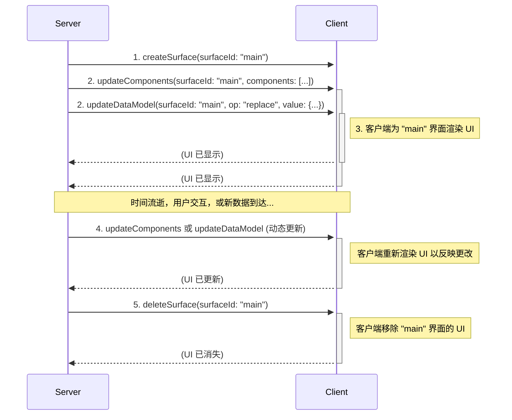
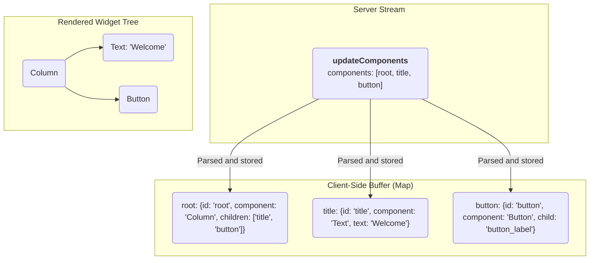

<!-- markdownlint-disable MD041 -->
<!-- markdownlint-disable MD033 -->
<div style="text-align: center;">
  <div class="centered-logo-text-group">
    
    <h1>A2UI (Agent to UI) 协议 v0.9</h1>
  </div>
</div>

基于 JSON 的流式 UI 协议规范。

**版本：** 0.9
**状态：** 草案
**创建时间：** 2025年11月20日
**最后更新：** 2025年12月3日

基于 JSON 的流式 UI 协议规范

## 简介

A2UI 协议设计用于从 A2A 服务器发送的 JSON 对象流动态渲染用户界面。其核心理念强调 UI 结构和应用程序数据的清晰分离，从而在客户端处理每条消息时实现渐进式渲染。

通信通过 JSON 对象流进行。客户端将每个对象解析为不同的消息，并增量构建或更新 UI。服务器到客户端协议定义了四种消息类型：

- `createSurface`: 信号通知客户端创建一个新界面并开始渲染。
- `updateComponents`: 提供要添加到或在特定界面中更新的组件定义列表。
- `updateDataModel`: 提供要插入到或替换界面数据模型的新数据。
- `deleteSurface`: 显式地从 UI 中移除界面及其内容。

## 与先前版本的变更

A2UI 协议的 0.9 版本代表了与以前版本的理念转变。虽然 v0.8 针对支持结构化输出的 LLM 进行了优化，但 v0.9 旨在直接嵌入到模型的提示词中。然后要求 LLM 生成与提供的示例和模式描述相匹配的 JSON。

这种“提示词优先”的方法提供了几个优势：

1.  **更丰富的模式：** 协议不再受结构化输出格式约束的限制。这允许更可读、更复杂和更具表现力的组件目录。
2.  **模块化：** 模式现在重构为独立的、更易于管理的组件（例如 [`common_types.json`]、[`standard_catalog_definition.json`]、[`server_to_client.json`]），提高了可维护性和模块化。

这种方法的主要缺点是它需要更复杂的生成后验证，因为 LLM 不受模式的严格约束。这需要强大的错误处理和纠正机制，以便系统可以在渲染之前识别差异并尝试修复它们，或者请求 LLM 重试或纠正。

## 协议概览与数据流

A2UI 协议使用从服务器到客户端的单向 JSON 消息流来描述和更新 UI。客户端消费此流，构建 UI 并进行渲染。用户交互单独处理，通常是通过将事件发送到不同的端点，这反过来可能会在 UI 流上触发新消息。

以下是一个示例事件序列（不必完全按照此顺序）：

1.  **创建界面 (Create Surface):** 服务器发送 `createSurface` 消息以初始化界面。
2.  **更新界面 (Update Surface):** 服务器发送一条或多条 `updateComponents` 消息，其中包含将成为界面一部分的所有组件的定义。
3.  **更新数据模型 (Update Data Model):** 服务器可以随时发送 `updateDataModel` 消息来填充或更改 UI 组件将显示的数据。
4.  **渲染 (Render):** 客户端为界面渲染 UI，使用组件定义构建结构并使用数据模型填充内容。
5.  **动态更新 (Dynamic Updates):** 随着用户与应用程序交互或新信息变得可用，服务器可以发送额外的 `updateComponents` 和 `updateDataModel` 消息来动态更改 UI。
6.  **删除界面 (Delete Surface):** 当不再需要 UI 区域时，服务器发送 `deleteSurface` 消息将其移除。



## 协议模式

A2UI v0.9 由三个相互交互的 JSON 模式定义。

### 通用类型 (Common Types)

[`common_types.json`] 模式定义了整个协议中使用的可重用原语。

- **`stringOrPath` / `numberOrPath` / `booleanOrPath` / `stringArrayOrPath`**: 数据绑定系统的核心。任何可以绑定到数据的属性都被定义为接受字面量值或 `path` 字符串 ([JSON Pointer]) 的对象。
- **`childrenProperty`**: 定义容器如何持有子级。它支持：

  - `array`: 字符串组件 ID 的静态数组。
  - `object`: 用于从数据绑定列表生成子级的模板（需要模板 `componentId` 和数据绑定 `path`）。

- **`id`**: 组件的唯一标识符。在此处定义以便所有 ID 保持一致并可用于数据绑定。
- **`weight`**: Row 或 Column 中组件的相对权重。这对应于 CSS 的 'flex-grow' 属性。注意：这仅当组件是 Row 或 Column 的直接后代时才能设置。在此处定义以便所有权重保持一致并可用于数据绑定。

### 服务器到客户端消息结构：信封 (The Envelope)

[`server_to_client.json`] 模式是顶级入口点。服务器流式传输的每一行都必须针对此模式进行验证。它处理消息分发。

### 标准目录 (The Standard Catalog)

[`standard_catalog_definition.json`] 模式包含所有特定 UI 组件（例如 `Text`, `Button`, `Row`）的定义。通过将其与信封分离，开发人员可以轻松换入自定义目录（例如 `material_catalog.json` 或 `cupertino_catalog.json`），而无需重写核心协议解析器。

自定义目录可用于定义其他 UI 组件或修改现有组件的行为。要使用自定义目录，只需在提示词中包含它以代替标准目录。它应具有与标准目录相同的形式，并使用 [`common_types.json`] 模式中的通用元素。

## 信封消息结构

信封定义了四种主要消息类型，服务器流式传输的每条消息必须是一个 JSON 对象，且包含且仅包含以下键之一：`createSurface`, `updateComponents`, `updateDataModel`, 或 `deleteSurface`。键指示消息的类型，这些是构成协议流中每条消息的消息。

### `createSurface`

此消息信号通知客户端创建一个新界面并开始渲染。必须在引用此 `surfaceId` 的第一条 `updateComponents` 消息之前发送此消息。组件列表中的某个组件必须具有 ID `root` 以充当组件树的根。

**属性：**

- `surfaceId` (字符串，必需): 要渲染的 UI 界面的唯一标识符。
- `catalogId` (字符串，必需): 唯一标识用于此界面的组件目录的字符串。建议用你拥有的互联网域作为前缀，以避免冲突（例如 `https://mycompany.com/1.0/somecatalog`）。

**示例：**

```json
{
  "createSurface": {
    "surfaceId": "user_profile_card",
    "catalogId": "https://a2ui.dev/specification/0.9/standard_catalog_definition.json"
  }
}
```

### `updateComponents`

此消息提供了要添加到或在特定界面内更新的 UI 组件列表。组件作为扁平列表提供，它们的关系由邻接表中的 ID 引用定义。此消息在发送引用此 `surfaceId` 的 `createSurface` 消息之后才能发送。

**属性：**

- `surfaceId` (字符串，必需): 要更新的 UI 界面的唯一标识符。这通常是一个有意义的名称（例如 "user_profile_card"），并且必须在 GenUI 会话的上下文中唯一。
- `components` (数组，必需): 组件对象列表。组件作为扁平列表提供，它们的关系由邻接表中的 ID 引用定义。

**示例：**

```json
{
  "updateComponents": {
    "surfaceId": "user_profile_card",
    "components": [
      {
        "id": "root",
        "component": "Column",
        "children": ["user_name", "user_title"]
      },
      {
        "id": "user_name",
        "component": "Text",
        "text": "John Doe"
      },
      {
        "id": "user_title",
        "component": "Text",
        "text": "Software Engineer"
      }
    ]
  }
}
```

### `updateDataModel`

此消息用于发送或更新填充 UI 组件的数据。它允许服务器更改 UI 的内容，而无需重新发送整个组件结构。

**属性：**

- `surfaceId` (字符串，必需): 此数据模型更新适用的 UI 界面的唯一标识符。
- `path` (字符串，可选): 指向数据模型内特定位置的 JSON Pointer（例如 `/user/name`）。如果省略或设置为 `/`，将替换界面的整个数据模型。
- `op` (字符串，可选):要在数据模型上执行的操作。必须是 'add', 'replace' 或 'remove'。如果省略，默认为 'replace'。
- `value` (对象): 要在数据模型中更新的数据。这可以是任何有效的 JSON 对象。如果 `op` 是 'add' 或 'replace'，则为必需。如果 `op` 是 'remove'，则不允许。

**示例：**

```json
{
  "updateDataModel": {
    "surfaceId": "user_profile_card",
    "path": "/user",
    "op": "replace",
    "value": {
      "name": "Jane Doe",
      "title": "Software Engineer"
    }
  }
}
```

### `deleteSurface`

此消息指示客户端从 UI 中移除界面及其所有关联的组件和数据。

**属性：**

- `surfaceId` (字符串，必需): 要删除的 UI 界面的唯一标识符。

**示例：**

```json
{
  "deleteSurface": {
    "surfaceId": "user_profile_card"
  }
}
```

## 示例流

以下示例演示了渲染联系人表单的完整交互，表示为 JSONL 流。

```jsonl
{"createSurface":{"surfaceId":"contact_form_1","catalogId":"https://a2ui.dev/specification/0.9/standard_catalog_definition.json"}}
{"updateComponents":{"surfaceId":"contact_form_1","components":[{"id":"root","component":"Column","children":["first_name_label","first_name_field","last_name_label","last_name_field","email_label","email_field","phone_label","phone_field","notes_label","notes_field","submit_button"]},{"id":"first_name_label","component":"Text","text":"First Name"},{"id":"first_name_field","component":"TextField","label":"First Name","text":{"path":"/contact/firstName"},"usageHint":"shortText"},{"id":"last_name_label","component":"Text","text":"Last Name"},{"id":"last_name_field","component":"TextField","label":"Last Name","text":{"path":"/contact/lastName"},"usageHint":"shortText"},{"id":"email_label","component":"Text","text":"Email"},{"id":"email_field","component":"TextField","label":"Email","text":{"path":"/contact/email"},"usageHint":"shortText"},{"id":"phone_label","component":"Text","text":"Phone"},{"id":"phone_field","component":"TextField","label":"Phone","text":{"path":"/contact/phone"},"usageHint":"shortText"},{"id":"notes_label","component":"Text","text":"Notes"},{"id":"notes_field","component":"TextField","label":"Notes","text":{"path":"/contact/notes"},"usageHint":"longText"},{"id":"submit_button_label","component":"Text","text":"Submit"},{"id":"submit_button","component":"Button","child":"submit_button_label","action":{"name":"submitContactForm"}}]}}
{"updateDataModel": {"surfaceId": "contact_form_1", "path": "/contact", "op": "replace", "value": {"firstName": "John", "lastName": "Doe", "email": "john.doe@example.com"}}}
```

## 组件模型

A2UI 的组件模型旨在灵活，将协议结构与可用 UI 组件集分离。

### 组件对象

`updateComponents` 消息的 `components` 数组中的每个对象定义一个 UI 组件。它具有以下结构：

- `id` (字符串，必需): 唯一标识此特定组件实例的字符串。这用于父子引用。
- `weight` (数字，可选): 此组件在 `Row` 或 `Column` 中的相对权重，对应于 CSS `flex-grow` 属性。
- `component` (字符串，必需): 指定组件的类型（例如 `"Text"`）。
- **组件属性**: 与特定组件类型相关的其他属性（例如 `text`, `url`, `children`）直接包含在组件对象中。

这种结构旨在既灵活又严格验证。

### 组件目录

可用 UI 组件及其属性的集合在 **组件目录** 中定义。标准目录在 [`standard_catalog_definition.json`] 中定义。这允许不同的客户端支持不同的组件集，包括自定义组件。服务器必须生成符合客户端理解的组件目录的 `updateComponents` 消息。

### UI 组合：邻接表模型

A2UI 协议将 UI 定义为组件的扁平列表。树结构使用 ID 引用隐式构建。这称为邻接表模型。

容器组件（如 `Row`, `Column`, `List`, 和 `Card`）具有引用其子组件 `id` 的属性。客户端负责将所有组件存储在映射中（例如 `Map<String, Component>`）并在渲染时重建树结构。

此模型允许服务器以任何顺序发送组件定义，只要在触发渲染之前存在所有必要的组件即可。

组件树中必须且仅有一个 ID 为 `root` 的组件，充当组件树的根。在该组件定义之前，其他组件更新将没有可见效果，它们将被缓冲直到定义了根组件。一旦定义了根组件，客户端负责根据可用数据以最佳方式渲染树，跳过无效引用。



## 数据绑定、作用域和状态管理

A2UI 依赖于 UI 结构（组件）和状态（数据模型）之间严格定义的关系。本节定义了路径解析、迭代期间的变量作用域以及交互式组件的双向绑定的精确机制。

### 路径解析与作用域

A2UI 中的数据绑定使用 **JSON Pointers** ([RFC 6901]) 定义。指针如何解析取决于当前的 **评估作用域**。

#### 根作用域 (The Root Scope)

默认情况下，所有组件都在 **根作用域** 中运行。

- 根作用域对应于 `updateDataModel` 中提供的 `value` 的顶层对象。
- 以 `/` 开头的路径（例如 `/user/profile/name`）是 **绝对路径**。无论组件在 UI 树中嵌套在哪里，它们总是从数据模型的根开始解析。

#### 集合作用域（相对路径）

当容器组件（如 `Column`, `Row`, 或 `List`）利用 `childrenProperty` 的 **Template** 功能时，它会为绑定数组中的每个项目创建一个新的 **子作用域**。

- **模板定义：** 当容器将其子级绑定到路径（例如 `path: "/users"`）时，客户端会迭代该位置找到的数组。
- **作用域实例化：** 对于数组中的每个项目，客户端都会实例化模板组件。
- **相对解析：** 在这些实例化的组件内部，任何 **不** 以正斜杠 `/` 开头的路径都被视为 **相对路径**。

  - 在迭代 `/users` 的模板内部，相对路径 `firstName` 对于第一项解析为 `/users/0/firstName`，对于第二项解析为 `/users/1/firstName`，依此类推。

- **混合作用域：** 子作用域内的组件仍然可以通过使用绝对路径访问根作用域。

#### 示例：作用域解析

**数据模型：**

```json
{
  "company": "Acme Corp",
  "employees": [
    { "name": "Alice", "role": "Engineer" },
    { "name": "Bob", "role": "Designer" }
  ]
}
```

**组件定义：**

```json
{
  "id": "employee_list",
  "component": "List",
  "children": {
    "path": "/employees",
    "componentId": "employee_card_template"
  }
},
{
  "id": "employee_card_template",
  "component": "Column",
  "children": ["name_text", "company_text"]
},
{
  "id": "name_text",
  "component": "Text",
  "text": { "path": "name" }
  // "name" 是相对的。解析为 /employees/N/name
},
{
  "id": "company_text",
  "component": "Text",
  "text": { "path": "/company" }
  // "/company" 是绝对的。全局解析为 "Acme Corp"。
}
```

### 双向绑定与输入组件

接受用户输入的交互式组件 (`TextField`, `CheckBox`, `Slider`, `MultipleChoice`, `DateTimeInput`) 与数据模型建立 **双向绑定**。

#### 读/写契约

与静态显示组件（如 `Text`）不同，输入组件在用户交互时立即修改客户端数据模型。

1.  **读 (Model -> View):** 当组件渲染时，它从绑定的 `path` 读取其值。如果通过 `updateDataModel` 更新了数据模型，组件将重新渲染以反映新值。
2.  **写 (View -> Model):** 当用户与组件交互（例如，键入字符、切换框）时，客户端 **立即** 更新本地数据模型中绑定 `path` 处的值。

#### 响应性 (Reactivity)

由于本地数据模型是唯一的真实来源，来自输入组件的更新是 **响应式的**。

- 如果一个 `TextField` 绑定到 `/user/name`，并且一个单独的 `Text` 标签也绑定到 `/user/name`，那么当用户在文本字段中输入时，标签必须实时更新。

#### 服务器同步

必须注意的是，双向绑定是 **客户端本地的**。

- 用户输入（击键、切换） **不会** 自动触发对服务器的网络请求。
- 更新的状态仅在触发特定 **用户操作**（例如 `Button` 点击）时才发送到服务器。
- 当分发 `userAction` 时，操作的 `context` 属性可以引用修改后的数据路径，将用户的输入发送回服务器。

#### 示例：表单提交模式

1.  **绑定：** `TextField` 绑定到 `/formData/email`。
2.  **交互：** 用户输入 "jane@example.com"。`/formData/email` 处的本地模型已更新。
3.  **操作：** 一个“提交”按钮具有以下操作定义：

    ```json
    "action": {
      "name": "submit_form",
      "context": {
        "email": { "path": "/formData/email" }
      }
    }
    ```

4.  **发送：** 点击时，客户端解析 `/formData/email`（获取 "jane@example.com"）并将其在 `userAction` 负载中发送。

## 标准组件目录

[`standard_catalog_definition.json`] 提供了基准组件集。

| 组件 | 描述 |
| :--- | :--- |
| **Text** | 显示文本。支持简单的 Markdown。 |
| **Image** | 显示来自 URL 的图像。 |
| **Icon** | 显示来自预定义列表的系统提供的图标。 |
| **Video** | 显示来自 URL 的视频。 |
| **AudioPlayer** | 播放来自 URL 的音频内容。 |
| **Row** | 水平布局容器。 |
| **Column** | 垂直布局容器。 |
| **List** | 可滚动的组件列表。 |
| **Card** | 具有卡片样式的容器。 |
| **Tabs** | 一组选项卡，每个选项卡都有标题和子组件。 |
| **Divider** | 水平或垂直分隔线。 |
| **Modal** | 由主要内容中的按钮触发，显示在主要内容之上的对话框。 |
| **Button** | 可点击的按钮，分发操作。 |
| **CheckBox** | 带有标签和布尔值的复选框。 |
| **TextField** | 用户文本输入字段。 |
| **DateTimeInput** | 日期和/或时间输入。 |
| **ChoicePicker** | 用于选择一个或多个选项的组件。 |
| **Slider** | 用于在范围内选择数值的滑块。 |

## 使用模式：提示-生成-验证循环

A2UI 协议设计用于与大型语言模型的三步循环：

1.  **提示 (Prompt):** 为 LLM 构建提示词，包括：

    - 想要生成的 UI。
    - A2UI JSON 模式，包括组件目录。
    - 有效的 A2UI JSON 示例。

2.  **生成 (Generate):** 将提示词发送给 LLM 并接收生成的 JSON 输出。

3.  **验证 (Validate):** 根据 A2UI 模式验证生成的 JSON。如果 JSON 有效，则可以将其发送到客户端进行渲染。如果无效，可以在随后的提示词中将错误报告回 LLM，允许其自我纠正。

此循环允许高度的灵活性和鲁棒性，因为系统可以利用 LLM 的生成能力，同时仍然强制执行 UI 协议的结构完整性。

### 标准验证错误格式

如果验证失败，客户端（或代表客户端行事的系统）应向 LLM 发送 `error` 消息。为了确保 LLM 能够理解并纠正错误，请在 `error` 消息负载中使用以下标准格式：

- `code` (字符串，必需): 必须是 `"VALIDATION_FAILED"`。
- `surfaceId` (字符串，必需): 发生错误的界面 ID。
- `path` (字符串，必需): 指向验证失败字段的 JSON 指针（例如 `/components/0/text`）。
- `message` (字符串，必需): 简短的一句话描述验证失败的原因。

**示例错误消息：**

```json
{
  "error": {
    "code": "VALIDATION_FAILED",
    "surfaceId": "user_profile_card",
    "path": "/components/0/text",
    "message": "Expected stringOrPath, got integer"
  }
}
```

## 客户端到服务器消息

协议还定义了客户端可以发送到服务器的消息，这些消息在 [`client_to_server.json`] 模式中定义。这些用于处理用户交互和报告客户端信息。

### `userAction`

当用户与定义了 `action` 的组件（如 `Button`）交互时发送此消息。

**属性：**

- `name` (字符串，必需): 操作的名称。
- `surfaceId` (字符串，必需): 操作起源的界面 ID。
- `sourceComponentId` (字符串，必需): 触发操作的组件 ID。
- `timestamp` (字符串，必需): ISO 8601 时间戳。
- `context` (对象，必需): 包含组件 `action` 属性中提供的任何上下文的 JSON 对象。

### `error`

此消息用于向服务器报告客户端错误。

[`standard_catalog_definition.json`]: ../json/standard_catalog_definition.json
[`common_types.json`]: ../json/common_types.json
[`server_to_client.json`]: ../json/server_to_client.json
[`client_to_server.json`]: ../json/client_to_server.json
[JSON Pointer]: https://datatracker.ietf.org/doc/html/rfc6901
[RFC 6901]: https://datatracker.ietf.org/doc/html/rfc6901